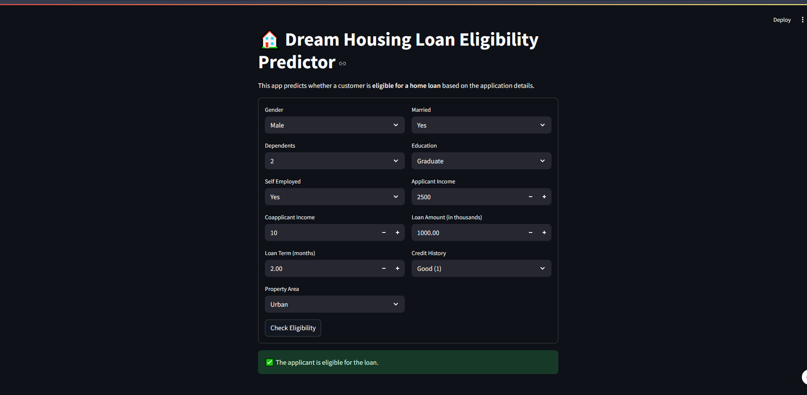

# 🏠 Loan Eligibility Prediction – Dream Housing Finance

This project automates the loan eligibility checking process for **Dream Housing Finance Company**, helping the organization filter customers likely to qualify for a home loan. The prediction is based on customer details submitted during the application, such as income, loan amount, credit history, and more.

---

## 🚀 Demo



---

## 📌 Project Description

Dream Housing Finance is looking to digitize and automate the loan eligibility process using machine learning. This Streamlit-based application classifies whether a customer is eligible (`1`) or not (`0`) for a loan based on their:

- Demographics (Gender, Marital Status, Dependents)
- Financials (Applicant Income, Coapplicant Income)
- Loan Details (Loan Amount, Term)
- Credit History and Area

---

## 🧠 Machine Learning Model

The model is trained using a classification algorithm such as **Logistic Regression**, **Random Forest**, or **XGBoost**, trained on a cleaned dataset with features:

- Gender
- Married
- Dependents
- Education
- Self_Employed
- ApplicantIncome
- CoapplicantIncome
- LoanAmount
- Loan_Amount_Term
- Credit_History
- Property_Area

The target variable is `Loan_Status` (0 = Not Eligible, 1 = Eligible).

---

## 📂 Project Structure

```bash
.
├── streamlit_app.py          # Main Streamlit app
├── loan_classifier.pkl       # Trained ML model
├── requirements.txt          # Dependencies
└── README.md                 # Project documentation
````

---

## ⚙️ How to Run the App

### Step 1: Clone the Repository

```bash
git clone https://github.com/yourusername/loan-eligibility-streamlit.git
cd loan-eligibility-streamlit
```

### Step 2: Install Dependencies

```bash
pip install -r requirements.txt
```

### Step 3: Run the App

```bash
streamlit run streamlit_app.py
```

---

## 🖥️ Sample Input UI

The user interface allows input for:

* Gender: Male/Female
* Married: Yes/No
* Dependents: 0/1/2/3+
* Education: Graduate/Not Graduate
* Self Employed: Yes/No
* Applicant & Coapplicant Income
* Loan Amount & Term
* Credit History
* Property Area

The app returns a clear result:

* ✅ Eligible
* ❌ Not Eligible

---

## 📊 Technologies Used

* Python 🐍
* Streamlit 📺
* scikit-learn 🤖
* pandas, numpy
* joblib

---

## 📈 Future Improvements

* Add user authentication
* Visualize input distributions
* Show SHAP values or feature importances
* Add multilingual support
* Deploy on platforms like **Streamlit Cloud** or **Render**

---

## 👨‍💻 Author

**Muhammad Sohaib** – AI Enthusiast 📫

~> [LinkedIn](linkedin.com/in/muhammad-sohaib-287799271) 

~>  [GitHub](https://github.com/mdsohaib15)

---


